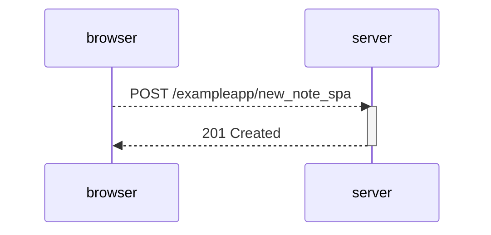

```mermaid
 sequenceDiagram  
  participant browser
  participant server

browser-->>server:POST /exampleapp/new_note_spa
activate server
server-->>browser:201 Created 
deactivate server
```

The redraw seems to only use the local array.    
The script doesn't make a GET request when POSTing a new note. 
It only fetches what's ACTUALLY in the server when it first loads in.
