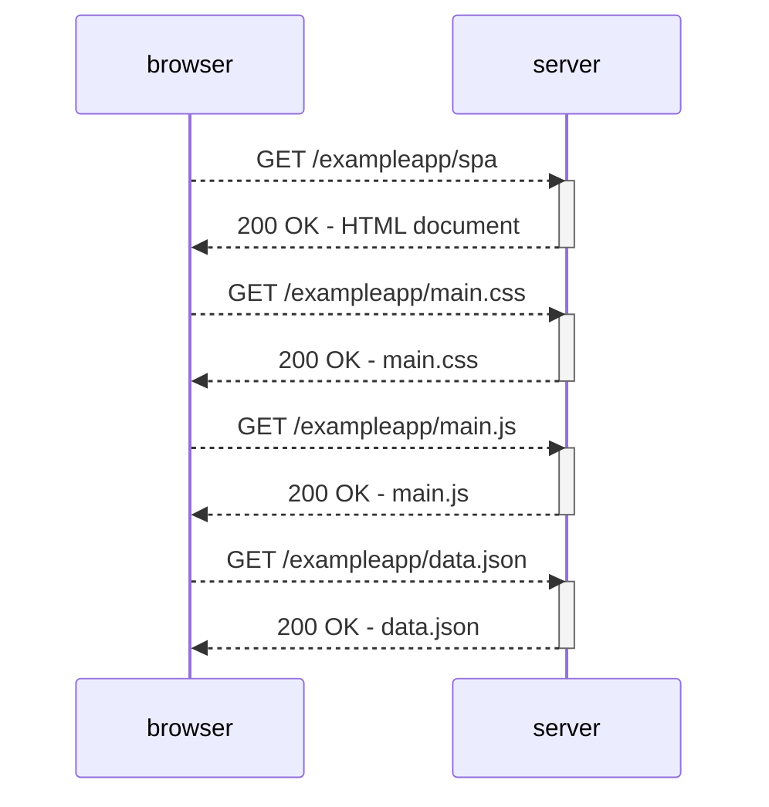

```mermaid
 sequenceDiagram  
  participant browser
  participant server

browser-->>server:GET /exampleapp/spa
activate server
server-->>browser:200 OK - HTML document
deactivate server

browser-->>server:GET /exampleapp/main.css
activate server
server-->>browser:200 OK - main.css
deactivate server

browser-->>server:GET /exampleapp/main.js
activate server
server-->>browser:200 OK - main.js
deactivate server

browser-->>server:GET /exampleapp/data.json
activate server
server-->>browser:200 OK - data.json 
deactivate server
```

  
